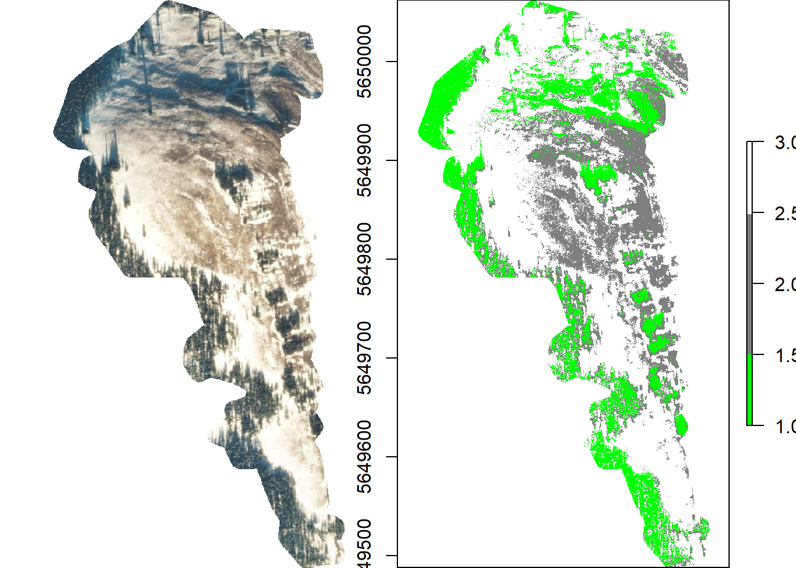

# AlpineSnowClassifier
A tool for estimating snow cover from alpine meadows using high resolution imagery and random forest

* [Objective](#Objective)
* [Contributor List](#Contributors)
* [Project Description](#Project-Description)

### Objective
Snow is a critical component on alpine ecology and provides a layer of insulation for overwintering species. Quantifying snow cover in these meadows is inherently difficult do challenges of access. Satellite imagery could be an effective tool for quantifying snow, but most available images are too low in resolution to provide effect estimates at the spatial resolution necessary for alpine ecosystems. High resolution imagery must be used either from satellites or aerial photography. However, alpine ecosystems are difficult to capture clear images. The rough topography and low angle of sunlight during winter creates shadows that makes quantifying snow using previous metrics (e.g. blue to red ratios) ineffective. Here we used machine learning on RGB values of high-resolution imagery to estimate snow cover in alpine meadows. We found that while correlated with visual estimates conducted manually by a human observer, machine learning frequently misclassified snow cover because of shadows creating significant variability in RGB values. 

### Contributors
- [Alessandro Filazzola](https://www.filazzola.info/)
- [Jens Roland](https://apps.ualberta.ca/directory/person/jroland)
- [Stephen F. Matter](https://researchdirectory.uc.edu/p/mattersf)

### Project Description

High resolution imagery was collected from [WorldView I satellite](https://earthdata.nasa.gov/worldview) (0.3 m resolution). Using an image from November snow cover in 2012, we subsampled 500 random points in five randomly chosen meadows. The pixels from each point was identified as either snow, rock/bareground, or forest. The RGB values for each pixel were extracted and used as predictors in a random forest with the three classifications as the response variable.  Confusion matrices were generated and models validated using 80:20 training:testing. We predicted snow cover for each meadow based on the RGB values for each image. Percent cover was estimated by dividing number of snow pixels by (number of snow pixels + number of rock pixels).

We found that the random forest estimate did a reasonably good job at predicting snow (~80%). However, shadows were frequently predicted to be forest or bareground when they were infact snow. The models thus had a low false-positive rate (3%) but a very high false-negative rate (14%). The predicted snow cover was found to be moderately correlated to visual estimates of snow cover (r = 0.59). While reasonably effective at predicting snow cover, we believe a human observer to be more precise in account for the complex topography in alpine images.

The analyses and imagery used can be found [here](https://afilazzola.github.io/AlpineSnowClassifier/index.html).

